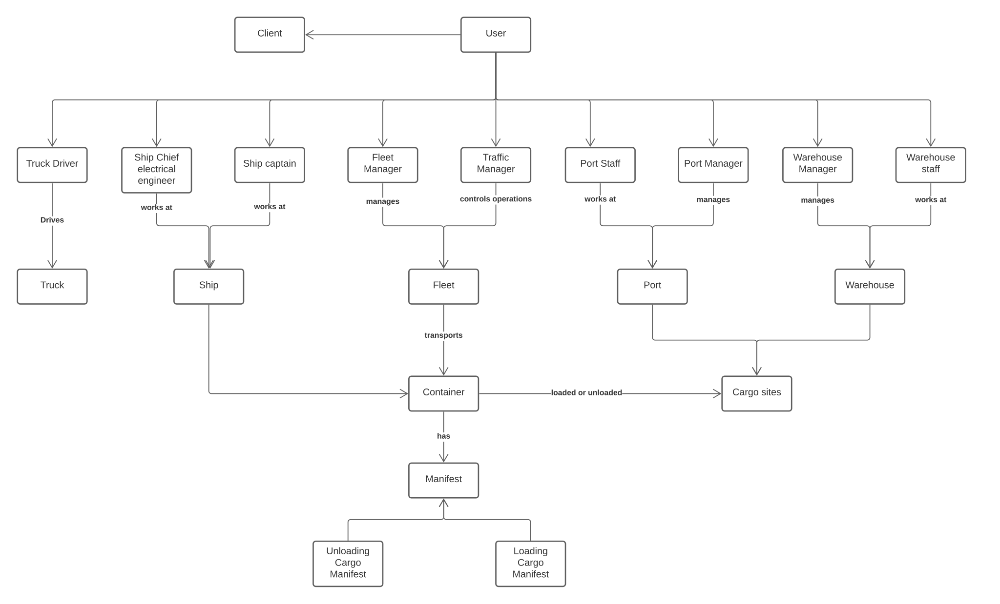
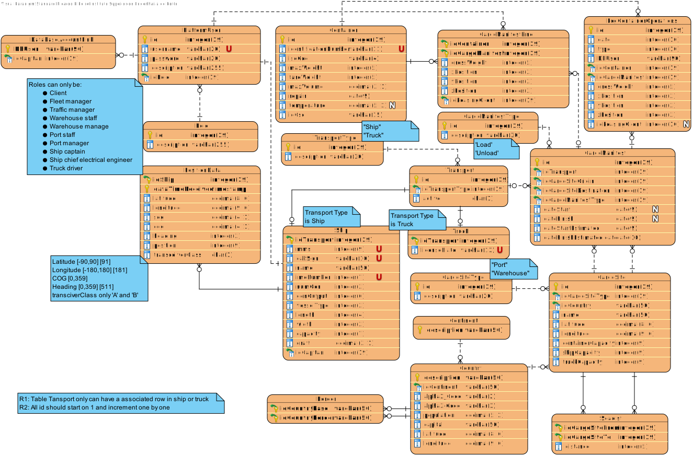

# **Group169 Database Documentation**
 
 * ## [Naming Conventions](NamingConvention.md)  
 * ## [Dictionary](Dictionary.md)
 * ## [Database Restrictions Catalog](DatabaseRestrictionsCatalog.md)
 * ## [Database Rational](Rational.md)
 * ## [Create Tables Script](CreateTables.sql)
 
---
# Diagrams
* ## Conceptual Diagram
    

* ## Logic Model Diagram
    
