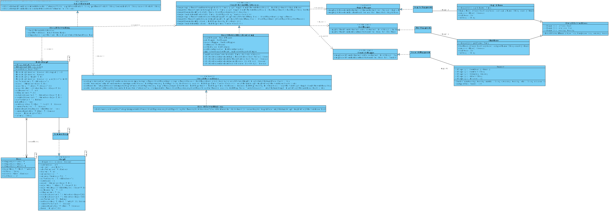
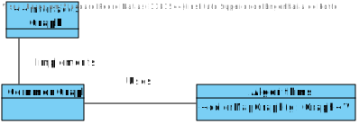
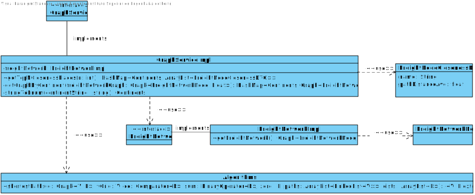

# Sprint 3 Group 169 Report

Our group in this Sprint decided once again to try and complete all the user stories listed for this sprint in the Project Assignment Sprint 2. Therefore, we divided the user stories between all members of the group and, even though we can only assign one person to each user story we all cooperated in each completed user story of this sprint. This was our User story distribution:

## User Story Distribution - Sprint 2
| Task      | Assigned To               | Docs Folder           |
|-----------|---------------------------|-----------------------|
| US 301    | [1181357] Rui Rafael      | [US 301](US301/)      |
| US 302    | [1181544] Pedro Matias    | [US 302](US302/)      |
| US 303    | [1151399] Afonso Pimentel | [US 303](US303/)*     |
| US 304    | [1181350] Ricardo Ribeiro | [US 304](Database/)*  |
| US 305    | [1181350] Ricardo Ribeiro | [US 305](Database/)*  |
| US 306    | [1151399] Afonso Pimentel | [US 306](Database/)*  |
| US 307    | [1151399] Afonso Pimentel | [US 307](Database/)*  |
| US 308    | [1151399] Afonso Pimentel | [US 308](Database/)*  |
| US 309    | [1181654] Jose Pinto      | [US 309](Database/)*  |
| US 310    | [1181654] Jose Pinto      | [US 310](Database/)*  |
| US 311    | [1181544] Pedro Matias    | [US 311](Database/)*  |
| US 312    | [1181357] Rui Rafael      | [US 312](Database/)*  |
| US 313    | [1181654] Jose Pinto      | [US 313](Database/)*  |
| US 314    | [1181357] Rui Rafael      | [US 314](../../arqcp/)|
| US 315    | [1181350] Ricardo Ribeiro | [US 315](../../arqcp/)|
| US 316    | [1181544] Pedro Matias    | [US 316](../../arqcp/)|
---
*Since US304~313 was mainly database work related we have a folder with that sole porpurse, that's why there isn't a 'US304~313' folder in the directory.

# Group's Main Documentation Files
* ## [Main Documentation](README.md)
* ## [Database Documentation](Database/README.md)
---
# User Stories Descriptions and Documentation Done
## User Story 301 | **ESINF**
* ### Description
    *  As a Traffic manager, I which to import data from countries, ports, borders and
seadists (files) from the database to build a freight network.
* ### Acceptance Criteria
    * The capital of a country has a direct connection with the capitals of the
countries with which it borders. The ports of a country, besides connecting with all the ports of the same country, the port closest to the
capital of the country connects with it; and finally, each port of a country
connects with the n closest ports of any other country.
    * The calculation of distances in Kms between capitals, and ports and
capitals must be done using the GPS coordinates.
    * The graph must be implemented using the adjacency matrix
representation and ensuring the indistinct manipulation of capitals and
seaports.
* ## Main Diagram
    * ## Class Diagram
        * 
    * Since the main objective of this User Story is to import countries, ports, borders and seadists from the database to build a freight network using graphs we had to implement generic classes of graphs to be able to meet every requested requirement. To avoid conflicts when we get evaluated for this tasks we implemented both importing data from files AND from the database.
* [Other Diagrams](US301/)
---
## User Story 302 | **ESINF**
* ### Description
    *  As a Traffic manager I wish to colour the map using as few colours as possible.
* ### Acceptance Criteria
    * Neighbouring countries must not share the same colour
* ## Main Diagram
    * ## Class Diagram
        * 
    * In this US we had to create an algorithm that assigned color to each vertice of graph which no adjecent vertice could have the same color and the whole algorithm had to use the minimum number of color as possible. We managed to do that by going one by one on each vertice and check each adjecent vertice and assigning a color to it depending on the color the adjecent vertices had.
* [Other Diagrams](US302/)
---
## User Story 303 | **ESINF**
* ### Description
    *  As a Traffic manager I wish to know which places (cities or ports) are closest to
all other places (closeness places)
* ### Acceptance Criteria
    * Return the n closeness locals by continent.
    * The measure of proximity is calculated as the average of the shortest path
length from the local to all other locals in the network.
* ## Main Diagram
    * ## Class Diagram
        * 
    * This US starts of by creating a HashMap, with Continents as keys and the value is a graph created by the adjacent vertices of that continent, from the Freight Network graph already loaded in the system getGraphByContinent() .After that uses the shortestPath() Algorithm on each value of the HashMap in order to find the closest point and finally it uses the getTopNClossenessPlace() method to return a HashMap ordered by the closest point in ascending order and the number of result is chosen by the Client.
* [Other Diagrams](US303/)

